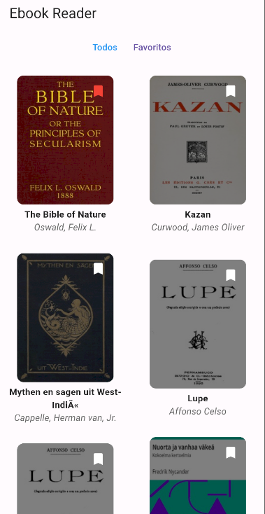

# eBook Reader

eBook Reader é um aplicativo de leitura de ebooks desenvolvido em Flutter, proporcionando uma experiência de leitura imersiva e fácil de usar. Ele suporta a leitura de livros no formato EPUB.

# Recursos Principais
-   **Leitura de Ebooks**: Suporte completo, através do package [VocsyEpubViewer](https://pub.dev/packages/vocsy_epub_viewer), para leitura de ebooks no formato EPUB.
-   **Visualização Personalizável**: Oferece opções de personalização, como tamanho da fonte, cor de fundo e modo noturno.
-   **Favoritos**: Possibilidade de marcar livros como favoritos para facilitar o acesso.
-   **Interface Intuitiva**: Interface do usuário amigável, proporcionando uma experiência de leitura agradável.

## Packages utilizados.

- Provider: Utilizei o Provider por ser simples e rápido para poder gerenciar o estado da aplicação com o ChangerNotifier.

- http: Pacote http para utilização de chamadas de API. 

- path_provider: Utilizei o Path_Provider para salvar o epub no dispositivo do usuário. 

- vocsy_epub_viewer: O Vocsy Epub Viewer, foi utilizado para a realização da leitura dos epubs.

- shared_preferences: Utilizei o SharedPreferences para o armazenamento de dados dos livros. Sua facilidade e simplicidade agilizou o processo de desenvolvimento. 

- cached_network_image: Utilizei o Cached Network Image para salvar as imagens em cache, deixando o aplicativo um pouco mais rápido. 

## Como utilizar o aplicativo

1.  **Baixe o Aplicativo**: Baixe o aplicativo no release e instale-o em seu dispositivo.
    
2.  **Navegue pelos Livros**: Explore a biblioteca de ebooks disponíveis, visualizando as capas dos livros.
    
3.  **Leia seu Ebook**: Ao tocar no livro, você baixará o mesmo para começar a leitura. Use gestos intuitivos para navegar pelas páginas.

4.  **Adicione Favoritos**: Marque seus livros favoritos para acessá-los facilmente. 

5. **Apague os livros**: Para apagar os livros do seu dispositivo, só desmarque o livro dos favoritos.

6. **Retorne para onde estava**: É possível retornar para onde parou de ler. Após a saída da leitura, o aplicativo irá guardar as informações no SharedPreferences e na próxima vez que abrir o livro, retornará para a página que estava.
   
## Como utilizar o aplicativo pelo Android Studio

1. Faça um `git clone https://github.com/lithoykai/ebookReader.git`
2. Abra o projeto pelo Android Studio/Visual Code
3. Antes de rodar no emulador Android, é necessário utilizar o `flutter pub get`para baixar as dependências do projeto. 
4. Após o `flutter pub get`, o projeto estará pronto para ser testado via emulador. 

## ScreenShots
 
 